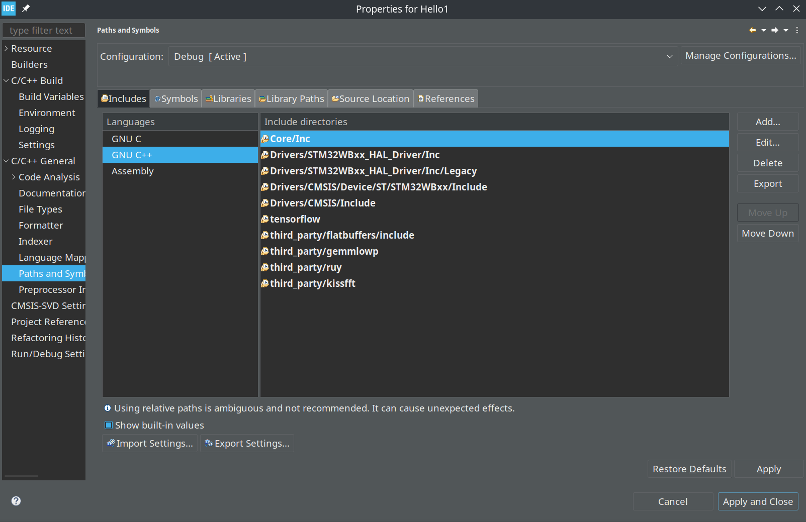
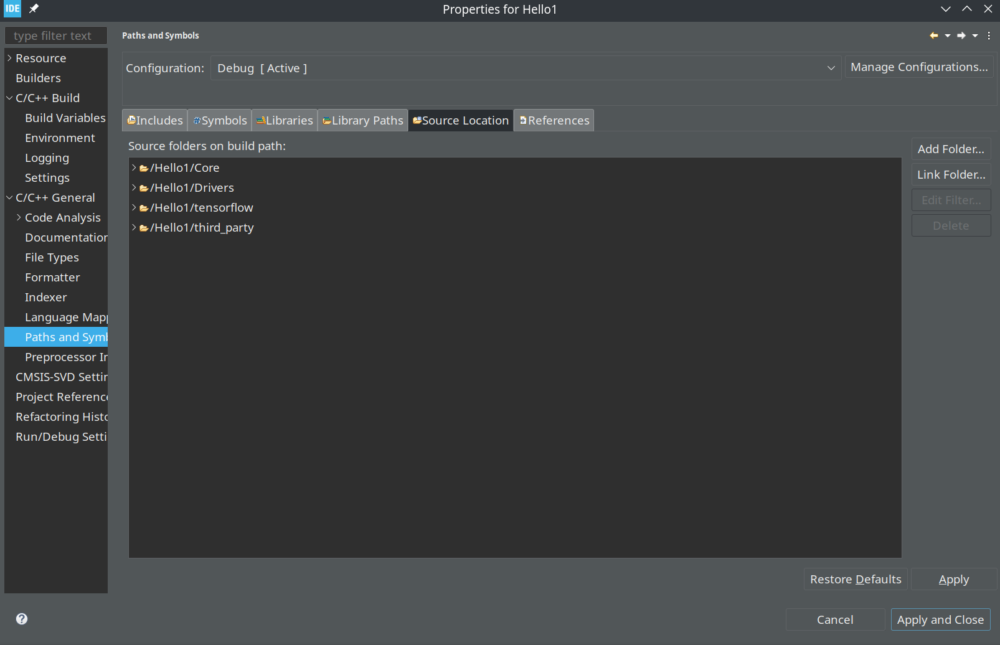

# tflite-micro-nucleo-wb55rg-examples

# TFLITE for STM32

## Preparing tensorflow for using with STM board

```
cd ~/workspace
git clone https://github.com/tensorflow/tflite-micro.git
cd tflite-micro
```

## TF files prepared using the command

```
python3 tensorflow/lite/micro/tools/project_generation/create_tflm_tree.py  -e hello_world --makefile_options="TARGET_ARCH=cortex-m4" <path to cubeide project>
```

## Prepare board support for TFLite

Important: Move tensorflow folder to a new folder names tensorflow itself, so the path to the "tensorflow/lite/micro/" will be like below
```
<Project path>/tensorflow/tensorflow/lite/micro/
```

Delete the following files 
```
rm <Project path>/tensorflow/tensorflow/lite/micro/system_setup.cc
rm <Project path>/tensorflow/tensorflow/lite/micro/debug_log.cc
rm <Project path>/tensorflow/tensorflow/lite/micro/micro_time.cc
```

Copy the board support files to the micro folder 

```
cp <path of nucleo-wb55rg> <Project path>/tensorflow/tensorflow/lite/micro/
```

# Adjust project settings for STMCube IDE

Essentials configurations are as following





# Using Hello1 project as a CubeIDE project

- Hello1 folder can be opened in CudeIDE ( reference project )


